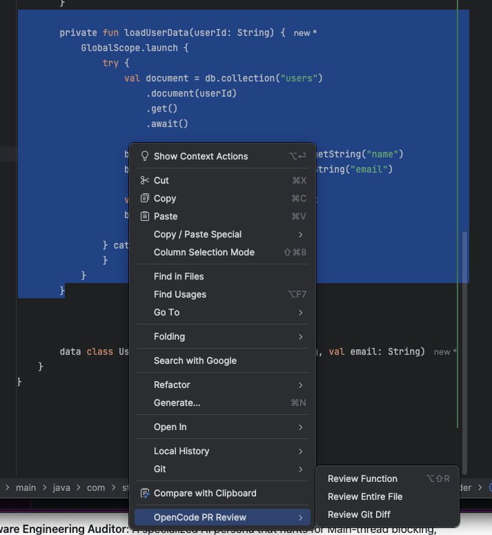
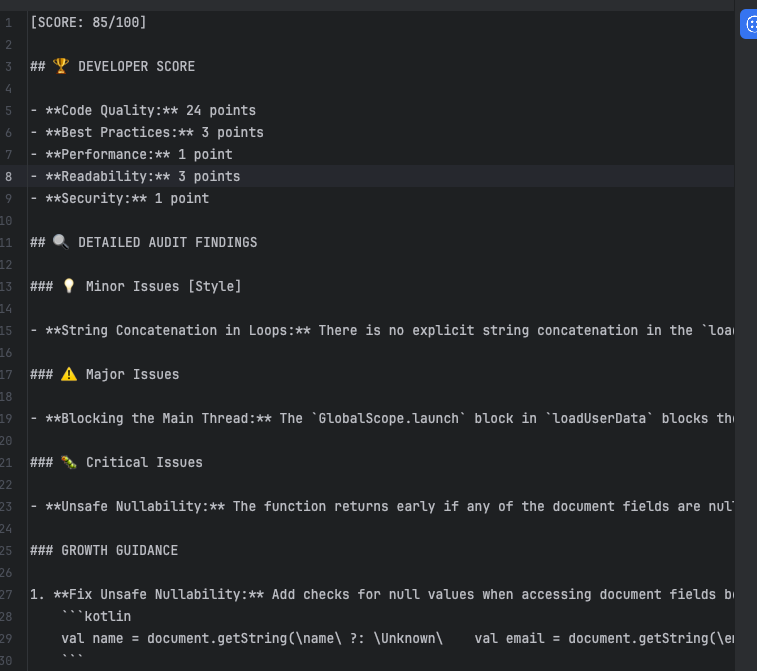
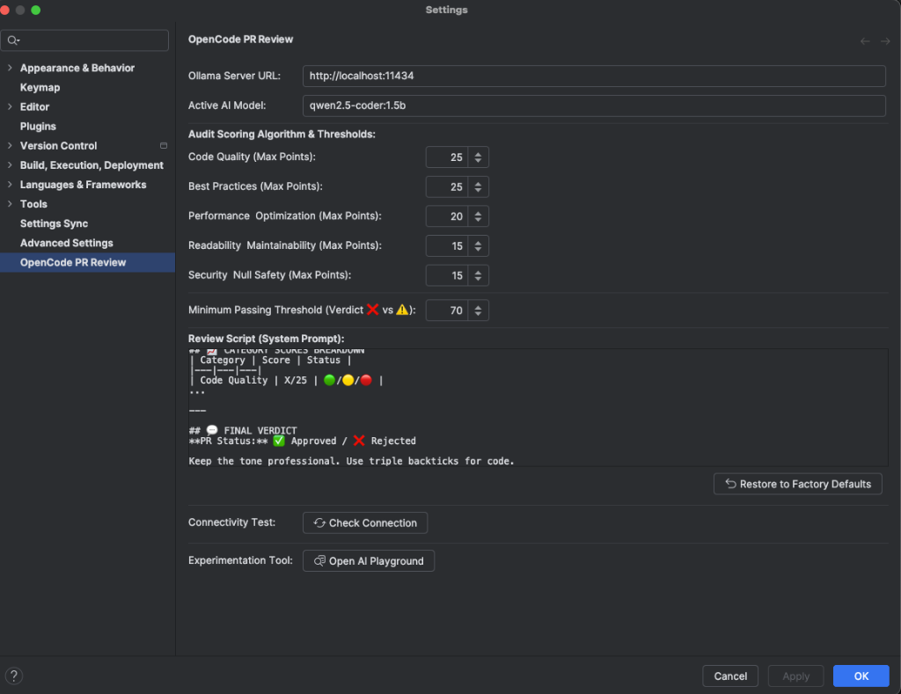

# 🛡️ OpenCode PR Review - Enterprise AI Auditor

**OpenCode PR Review** is a high-performance Android Studio plugin that transforms your IDE into a **Rigorous Technical Lead**. It uses local AI models to perform deep architectural, performance, and security audits—complete with **Dynamic Weighting**, **Mentorship Guidance**, and **Professional PDF-Ready Reports**.



---

## 🚀 Key Features
- **🕵️ Expert Software Engineering Auditor**: A specialized AI persona that hunts for Main-thread blocking, string-concatenation leaks, and architectural violations.
- **⚖️ Dynamic Audit Dashboard**: Manually adjust weights for **Code Quality**, **Performance**, **Security**, and **Best Practices** in your settings.
- **🏁 Custom Passing Thresholds**: Set your own quality bar (e.g., Reject any PR with a score < 80).
- **👨‍🏫 Growth Mentorship**: Every finding includes "Growth Guidance" with links to official **Kotlin** and **Android** documentation.
- **📊 Enterprise Audit Dashboard**: Export beautiful, print-ready HTML reports with executive summaries and professional line-numbered code cards.
- **🧪 AI Playground**: Test your prompt scripts and weighting logic in a real-time sandbox before deploying them to your team.



---

## 🏎️ Running as an Open Source Developer

If you are contributing to OpenCode, follow these steps to build and run the plugin in a development environment:

### 1. Project Setup
- **IDE**: We recommend using **IntelliJ IDEA (2023.x or later)** or **Android Studio**.
- **JDK**: Ensure you are using **JDK 17 or 18**.
- **Clone**: `git clone https://github.com/shahwaiz90/OpenCode-PR-Review-Plugin.git`

### 2. Core Gradle Commands
Open your terminal in the project root and use these commands:

#### 🚀 Launch the Sandbox IDE
This command compiles the plugin and opens a fresh instance of the IDE with the plugin pre-installed.
```bash
./gradlew runIde
```

#### 🏗️ Build the Plugin Distribution
This generates a release-ready `.zip` that can be manually installed in any Android Studio instance.
```bash
./gradlew buildPlugin
```

---

## 🏗️ Getting Started (User Guide)

### 1. Setup Local AI (Ollama)
OpenCode PR Review works best with a local, private LLM for absolute code security.
- **Download Ollama**: [ollama.com](https://ollama.com/)
- **Pull a Coding Model**: Run: `ollama pull qwen2.5-coder:latest`
- **Verify**: Ensure the server is running at `http://localhost:11434`.

### 2. Configure the Plugin
1. Open **Android Studio** → **Settings / Preferences**.
2. Navigate to **Tools** → **OpenCode PR Review**.
3. Set your **Ollama Server URL**: `http://localhost:11434`.
4. Choose your **Active AI Model**: `qwen2.5-coder:latest`.
5. Dial in your **Audit Weighting & Thresholds** to match your team’s standards.



---

## 🎯 Our Mission
Our goal is to help developers grow while ensuring enterprise-level code quality. We believe in strict enforcement paired with compassionate mentorship.

### You feel me? 🛡️✨🏢
---
*OpenCode PR Review is an open-source project by Ahmad Shahwaiz and the community.*
